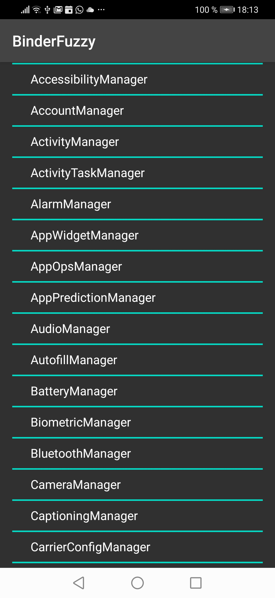
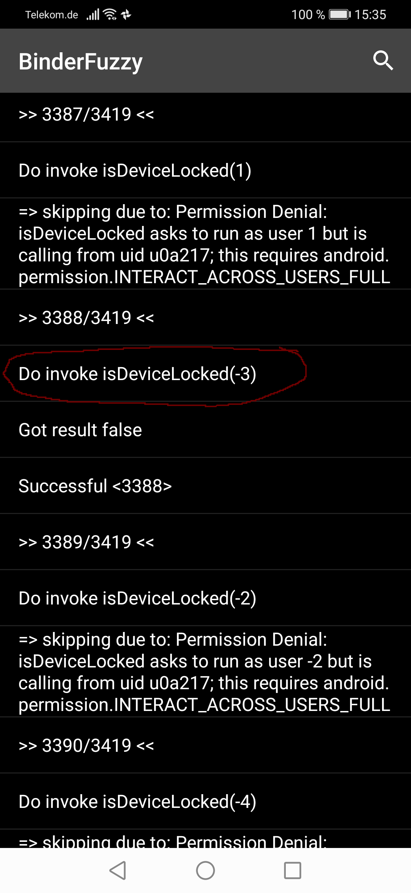

# BinderFuzzy


An App intended for fuzzing the Binder interface and System Services of Android.
You can use this Project in order to find bugs and exploits inside the Binder interface or System Services.

# Usage

Watch this Youtube Video for a quick introduction

[](https://www.youtube.com/watch?v=4uXdXq7E2Uw "BinderFuzzy")


Binder fuzzy can be used via the python client or via the App itself. Choose one for your needs.

## Using the Python script

### Prerequisites
* Python 3.0
* Ubuntu Linux 18.04

### Installation

WIP

### Examples

```bash
python3 binderFuzzy.py --fuzzy-apk binderfuzzy-release.apk --script startActivity.bf
```

### Configuration

```json
{
	"fields_ordered" : [
	    {
		    "clazz": "android.app.ActivityTaskManager",
		    "field": "IActivityTaskManagerSingleton"
	    },
	    {
	        "clazz": "android.util.Singleton",
	        "field": "mInstance"
	    }
	],
	"call" : {
	    "clazz": "android.app.IActivityTaskManager",
	    "method": "startActivity(",
	    "params":[
	        "auto",
	        "packageNames",
	        "launchIntents",
	        "packageNames",
	        "auto",
	        "packageNames",
	        "auto",
	        "auto",
	        "null",
	        "auto"
	    ]
	}
}
```

## Using the Android App

### Prerequisites

* Android 6 or greater

### Installation

* Download APK [here](https://github.com/ChickenHook/BinderFuzzy/releases/download/0.1/binderfuzzy-release.apk)
* Enable unknown source during installation

See our video: []()


### The Browser

#### 1. Select System Service to attack

First step is to select a System Service we're going to fuzz. After a click on the "NEW" button the list of available Services appears and you can choose one.



#### 2. Select function or objects to create the call

The next screen lists all members: functions and fields. 
```
=> If you click on a field the browser will open the object in a new Window.
=> If you click on a method the browser forwards this to the FuzzCreator.
```


### 3. Parameter configuration
Now you have to configure the parameters of the call. Some parameters have special options like integers, strings and intents. You can open a feature request if you need more features here.
However, you must click on each parameter and configure how the fuzzer shall gather the values for the call.


### Start the test
Once you're finished you can press the START button and the test begins.


### Strange findings

#### Negative UserID

Passing user -3 as parameter will bypass the permission check.




## Other Projects

| Project | Description |
|---------|-------------|
| [ChickenHook](https://github.com/ChickenHook/ChickenHook) | A linux / android / MacOS hooking framework  |
| [BinderHook](https://github.com/ChickenHook/BinderHook) | Library intended to hook Binder interface and manipulate events |
| [RestrictionBypass](https://github.com/ChickenHook/RestrictionBypass) |  Android API restriction bypass for all Android Versions |
| [AndroidManifestBypass](https://github.com/ChickenHook/AndroidManifestBypass) |  Android API restriction bypass for all Android Versions |
| .. | |
